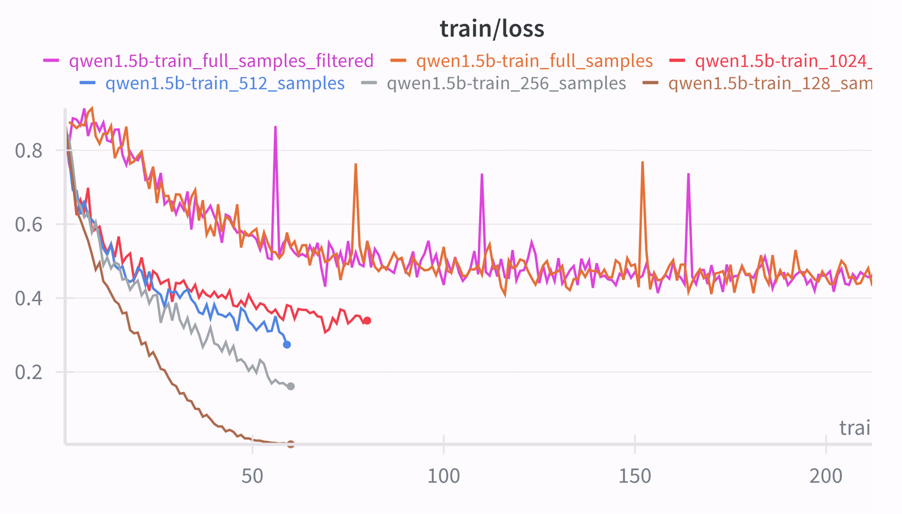
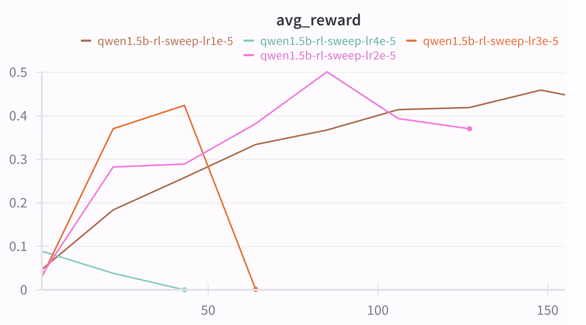
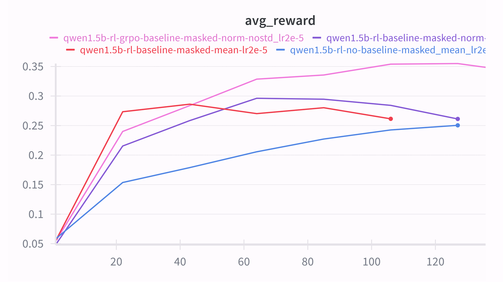
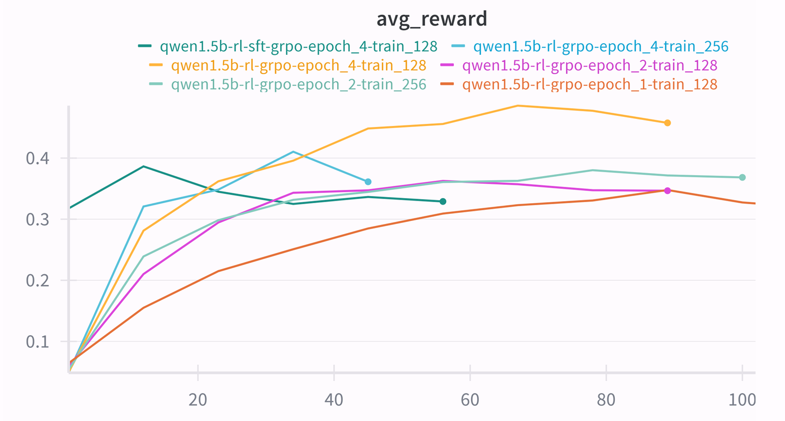

# CS336 Spring 2025 Assignment 5: Alignment

This is my implementation for Assignment 5, which includes Supervised Fine-tuning and Reasoning RL (GRPO) from scratch on Qwen2.5-Math-1.5B.

For a full description of the assignment, see the assignment handout at
[cs336_spring2025_assignment5_alignment.pdf](./cs336_spring2025_assignment5_alignment.pdf)

We include a supplemental (and completely optional) assignment on safety alignment, instruction tuning, and RLHF at [cs336_spring2025_assignment5_supplement_safety_rlhf.pdf](./cs336_spring2025_assignment5_supplement_safety_rlhf.pdf)

If you see any issues with the assignment handout or code, please feel free to
raise a GitHub issue or open a pull request with a fix.

## Setup

As in previous assignments, we use `uv` to manage dependencies.

1. Install all packages except `flash-attn`, then all packages (`flash-attn` is weird)
```
uv sync --no-install-package flash-attn
uv sync
```

2. Run unit tests:

``` sh
uv run pytest
```

Initially, all tests should fail with `NotImplementedError`s.
To connect your implementation to the tests, complete the
functions in [./tests/adapters.py](./tests/adapters.py).

## Data Availability

One could get access to MATH dataset via:

```
# Make sure the hf CLI is installed
uv tool install hf
hf download garg-aayush/sft-cs336-assign5-datasets --repo-type=dataset
```

## GPU requirments

For SFT part, I personally used 2 vGPU (48GB), with 1 for training and another for vLLM evaluation.

For Reasoning RL part, I used 1 H800 for both training and vLLM evaluation.

## Supervised Fine-Tuning

This part implements SFT from scratch.

In ``SFT_helper.py``, the followings are implemented:

* ``tokenize_prompt_and_output``: Concatenate and tokenize the prompt and output strings, return input_ids, labels and response mask for training.
* ``compute_entropy``: Calculate token-level entropy given logits.
* ``get_response_log_probs``: Given input_ids and labels, calculate token-level log_probs with numerical stability methods.
* ``masked_normalize``: The masked normalized sum of an input tensor.
* ``sft_microbatch_train_step``: A micro SFT step in gradient accumulation step, return step-loss divided by gradient_accumulation_steps.

In ``policy_evaluation.py``, the followings are implemented:

* ``init_vllm``: Start the inference process, use vLLM to hold a model separate from the policy.
* ``load_policy_into_vllm_instance``: Load current policy model's weight into existing vLLM instance.
* ``evaluate_vllm``: Generate response based on vLLM instance and evaluate the performance of model, including reward, response length and entropy, this happens during the training process.
  
In ``SFT_train.py``, the training framework is implemented. One could sweep and adjust the configs in ``config.yaml`` to get a better sense of SFT. The training process takes about 30 minutes on 2 vGPU-48GB.

The train loss curves from different samples used for training:


## Reasoning RL - GRPO

This part implements Reasoning RL from scratch.

In ``GRPO_helper.py``, the followings are implemented:

* ``compute_group_normalized_rewards``: Compute group normalized rewards for a batch of responses and ground-truth.
* ``compute_policy_gradient_loss``: Compute token-level loss (log_probs * rewards or advantages), there are three types: ``["no_baseline", "reinforce_with_baseline", "grpo_clip"]``.
* ``grpo_microbatch_train_step``: A micro step in gradient accumulation step, return step-loss divided by gradient_accumulation_steps.

In ``GRPO_train.py``, the training framework is implemented. The configs are in ``grpo_train.yaml``. The training process varies from 40 minutes to 80 minutes on 1 H800 GPU.

The sweep of learning rate -- The evaluations were done on 1024 out of 5000 eval datasets:


The ablation of length normalization, standart deviation in rewards, and loss type -- The evaluations were done on full 5000 eval datasets:


The GRPO with multiple tries of epochs and train batchsize, in addition, there is an experiment of RL training on the base of SFT model obtained in the SFT stage, which I found underperform than purely RL trained models.

